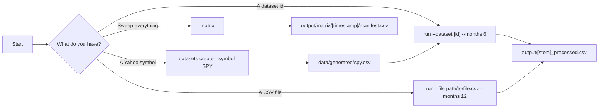

# Finance CLI

`Python CLI` `CSV-first` `Monthly screening` `Yahoo-backed datasets` `Matrix sweeps`

Finance CLI is a CSV-first command-line tool for screening monthly ETF, stock, and similar market datasets with configurable indicators and rule-based signals.

It is built for four practical jobs:

| Job | What it gives you |
| --- | --- |
| Analyze a named dataset | Run repeatable analysis against CSVs discovered from `data/generated/` |
| Analyze your own CSV | Run the same logic on any file path without importing it |
| Create and refresh live datasets | Pull monthly OHLCV history from Yahoo Finance and keep it refreshable |
| Sweep the full matrix | Run a fixed grid of indicators, rules, and month windows across all generated datasets |

> [!TIP]
> First run? Open the guided wizard with `python3 dynamic_range_average.py`.

> [!IMPORTANT]
> This project is a screening and inspection tool. It is not a backtester, portfolio optimizer, or complete trading system.

## Quick Links

- [Start Here](#start-here)
- [Workflow Map](#workflow-map)
- [Common Workflows](#common-workflows)
- [Command Cookbook](#command-cookbook)
- [Files and Outputs](#files-and-outputs)
- [Signal Logic](#signal-logic)
- [Limits and Caveats](#limits-and-caveats)
- [Contributor Notes](#contributor-notes)

## Start Here

### Install

Install the Python dependencies:

```bash
python3 -m pip install -r requirements.txt
```

If your system Python is externally managed and the command above fails:

```bash
python3 -m pip install --user --break-system-packages -r requirements.txt
```

### 60-Second Start

Open the guided wizard:

```bash
python3 dynamic_range_average.py
```

Or go straight to the CLI:

```bash
python3 dynamic_range_average.py datasets list
python3 dynamic_range_average.py run --dataset spy --months 6
python3 dynamic_range_average.py matrix
```

### Choose Your Entry Point

| If you want to... | Run this | Result |
| --- | --- | --- |
| Use the guided flow | `python3 dynamic_range_average.py` | Interactive wizard for creating, picking, or running datasets |
| Analyze a generated dataset | `python3 dynamic_range_average.py run --dataset spy --months 6` | Writes `output/spy_processed.csv` |
| Analyze a custom CSV | `python3 dynamic_range_average.py run --file path/to/custom.csv --months 12` | Writes `output/custom_processed.csv` by default |
| Create a Yahoo-backed dataset | `python3 dynamic_range_average.py datasets create --symbol SPY` | Writes `data/generated/spy.csv` |
| Refresh a generated dataset | `python3 dynamic_range_average.py datasets refresh --id spy` | Updates the dataset and writes a backup |
| Sweep every generated dataset | `python3 dynamic_range_average.py matrix` | Writes timestamped matrix output plus `manifest.csv` |

## Workflow Map



## Common Workflows

### 1. Analyze a Generated Dataset

| Best when | Core command | Default result |
| --- | --- | --- |
| You want a repeatable dataset id and predictable output file | `python3 dynamic_range_average.py run --dataset spy --months 6` | `output/spy_processed.csv` |

List available datasets:

```bash
python3 dynamic_range_average.py datasets list
```

Run one dataset:

```bash
python3 dynamic_range_average.py run --dataset 500_pa --months 6
```

Use a different indicator and rule:

```bash
python3 dynamic_range_average.py run --dataset spy --months 6 --indicator ema --rule "indicator > close"
```

Refresh first, then analyze:

```bash
python3 dynamic_range_average.py run --dataset aapl --months 6 --refresh
```

### 2. Analyze Your Own CSV

| Best when | Core command | Notes |
| --- | --- | --- |
| You want a one-off run on a file without importing it | `python3 dynamic_range_average.py run --file path/to/custom.csv --months 12` | The input file is not copied into `data/generated/` |

Run a custom file:

```bash
python3 dynamic_range_average.py run --file path/to/custom.csv --months 12
```

Write to a custom output path:

```bash
python3 dynamic_range_average.py run --file path/to/custom.csv --months 12 --output output/my_custom_screen.csv
```

Required columns:

- `date`
- `open`

Extra columns are allowed and remain in the processed output.

### 3. Create a Yahoo-Backed Dataset

| Best when | Core command | What happens |
| --- | --- | --- |
| You want a named dataset that can later be refreshed with live data | `python3 dynamic_range_average.py datasets create --symbol SPY` | Downloads monthly Yahoo Finance history into `data/generated/` |

Create a dataset:

```bash
python3 dynamic_range_average.py datasets create --symbol SPY
```

Another example:

```bash
python3 dynamic_range_average.py datasets create --symbol 500.PA
```

Resulting ids:

- `SPY` -> `data/generated/spy.csv`
- `500.PA` -> `data/generated/500_pa.csv`

The first `symbol` column stores the original Yahoo symbol, which is what later enables refresh.

### 4. Add or Remove a Generated Dataset

| Best when | Core command | Notes |
| --- | --- | --- |
| You already have a CSV and want it to behave like a named dataset | `python3 dynamic_range_average.py datasets add --path path/to/custom.csv` | Uses the source filename as the dataset id |

Copy an existing CSV into generated storage:

```bash
python3 dynamic_range_average.py datasets add --path path/to/custom.csv
```

Import a CSV and attach a refresh symbol:

```bash
python3 dynamic_range_average.py datasets add --path data/my_sp500.csv --refresh-symbol 500.PA
```

Remove a generated dataset:

```bash
python3 dynamic_range_average.py datasets remove --id spy
```

### 5. Refresh Generated Data

| Best when | Core command | Notes |
| --- | --- | --- |
| You want the latest available monthly data before screening | `python3 dynamic_range_average.py datasets refresh --id spy` | Works only for datasets with a non-empty `symbol` column |

Refresh one dataset:

```bash
python3 dynamic_range_average.py datasets refresh --id 500_pa
```

Refresh every refreshable dataset:

```bash
python3 dynamic_range_average.py datasets refresh --all
```

Backups are written to:

```text
tmp/refresh_backups/<input_stem>.backup.<timestamp>.csv
```

### 6. Run the Matrix Workflow

| Best when | Core command | Output |
| --- | --- | --- |
| You want a broad sweep instead of a single hand-picked run | `python3 dynamic_range_average.py matrix` | Per-dataset CSVs plus `manifest.csv` under a timestamped directory |

Run with the default output directory:

```bash
python3 dynamic_range_average.py matrix
```

Run with a custom output directory:

```bash
python3 dynamic_range_average.py matrix --output-dir output/matrix/latest
```

The matrix currently sweeps:

- month windows: `1`, `3`, `6`, `12`, `24`
- indicators: `ema`, `sma`, `wma`
- rules: `indicator` compared with `open`, `high`, `low`, and `close` using `>`, `<`, `>=`, and `<=`

Each run writes per-dataset CSVs plus a manifest summarizing status, output path, row count, and true-condition count.

## Command Cookbook

Use this section when you want the shortest path from task to command.

| Task | Command | Notes |
| --- | --- | --- |
| Open the wizard | `python3 dynamic_range_average.py` | Best first-run entry point |
| Show CLI help | `python3 dynamic_range_average.py --help` | Top-level commands: `run`, `matrix`, `datasets` |
| List generated datasets | `python3 dynamic_range_average.py datasets list` | Reads `data/generated/*.csv` only |
| Analyze one dataset | `python3 dynamic_range_average.py run --dataset spy --months 6` | Default indicator is `sma` |
| Analyze one CSV file | `python3 dynamic_range_average.py run --file path/to/custom.csv --months 12` | Does not import the file |
| Change indicator and rule | `python3 dynamic_range_average.py run --dataset spy --months 6 --indicator ema --rule "indicator > close"` | Rule format is `left_operand operator right_operand` |
| Refresh before running | `python3 dynamic_range_average.py run --dataset nvda --months 6 --refresh` | Generated datasets only |
| Create a dataset from Yahoo | `python3 dynamic_range_average.py datasets create --symbol AAPL` | Creates a refreshable generated dataset |
| Import a CSV as a dataset | `python3 dynamic_range_average.py datasets add --path path/to/custom.csv` | Uses the source filename as dataset id |
| Import and attach refresh metadata | `python3 dynamic_range_average.py datasets add --path data/my_sp500.csv --refresh-symbol 500.PA` | Enables live refresh |
| Remove a dataset | `python3 dynamic_range_average.py datasets remove --id spy` | Deletes the generated CSV |
| Refresh one dataset | `python3 dynamic_range_average.py datasets refresh --id spy` | Writes a backup first |
| Refresh all refreshable datasets | `python3 dynamic_range_average.py datasets refresh --all` | Skips non-refreshable generated datasets |
| Run the full matrix | `python3 dynamic_range_average.py matrix` | Writes outputs under `output/matrix/<timestamp>/` |

## Files and Outputs

> [!NOTE]
> Generated datasets are discovered only from `data/generated/*.csv`. Files outside that directory are never auto-discovered, but they still work with `run --file`.

### Dataset IDs

Dataset ids come directly from filenames:

- `data/generated/500_pa.csv` -> `500_pa`
- `data/generated/nvda.csv` -> `nvda`
- `data/generated/spy.csv` -> `spy`

### File Map

| Location | Purpose |
| --- | --- |
| `data/generated/` | Named generated datasets |
| `output/<input_stem>_processed.csv` | Default output for a single `run` command |
| `output/matrix/<timestamp>/` | Default output root for `matrix` runs |
| `output/matrix/<timestamp>/manifest.csv` | Manifest for the matrix run |
| `tmp/refresh_backups/` | Backups created before refresh writes |

Single-run examples:

- `data/generated/500_pa.csv` -> `output/500_pa_processed.csv`
- `data/generated/spy.csv` -> `output/spy_processed.csv`

You can override a single-run output path with `--output`, but it must still end in `.csv`.

> [!NOTE]
> The `output/` directory is treated as generated local output and is ignored by git for new files.

### Terminal and CSV Output Shape

The terminal output shows all analyzed rows, not only rows where `condition == 1`.

Output columns are ordered dynamically:

- key fields first when present: `symbol`, the two gap columns, `date`, `open`
- then remaining source columns in their original CSV order
- then derived analysis columns such as the indicator column, `moving_average_window_months`, `condition`, and optional `screening_rule`

Processed CSV files follow the same ordering as terminal output. That means they preserve:

- original source columns
- extra columns from custom CSV inputs
- derived analysis fields added by the app

### Output Columns to Watch

| Column | Meaning |
| --- | --- |
| `Moving_Average` | Legacy default indicator column when you do not pass `--indicator` or `--rule` |
| `EMA_6_months`, `SMA_12_months`, and similar | Indicator-specific columns used for non-default runs |
| `moving_average_minus_open_over_open` | Primary gap ratio showing how far the selected indicator sits above `open` |
| `open_minus_moving_average_over_moving_average` | Secondary gap ratio showing how far `open` sits above the selected indicator |
| `moving_average_window_months` | Window size used for the run |
| `condition` | `1` when the rule is true, otherwise `0` |
| `screening_rule` | Normalized rule string for non-default runs |

## Signal Logic

This project is centered on a simple monthly market-screening idea:

1. Load price history.
2. Calculate a selected indicator on monthly `open`.
3. Compute two gap ratios between the indicator and `open`.
4. Mark each row with a binary condition from a rule such as `indicator > open`.

It is best understood as a lightweight trend-following or time-series-momentum style screen, not as a complete investment system.

### Input Model

The methodology is designed around monthly market data.

- symbol-created and live-refreshed generated datasets are monthly Yahoo Finance OHLCV CSVs with `symbol`, `date`, `open`, `high`, `low`, `close`, `volume`
- imported generated datasets and direct custom CSV files must contain at least `date` and `open`
- extra source columns are allowed and flow through to processed output
- the CLI does not enforce monthly frequency for custom files, but the methodology in this README assumes monthly datasets

Before analysis, the app:

- parses `date`
- converts `open` to numeric
- validates that required fields are present
- sorts rows in ascending date order

### Signal Definition

For a chosen `--months` window, the app computes:

- a selected indicator on monthly `open` using `--indicator` with `ema`, `sma`, or `wma`
- `condition = 1` when the configured rule is true, else `0`
- `moving_average_minus_open_over_open = (indicator - open) / open`
- `open_minus_moving_average_over_moving_average = (open - indicator) / indicator`
- `moving_average_window_months` for traceability

Default behavior stays backward-compatible:

- if you do not pass `--indicator` or `--rule`, the output keeps the legacy `Moving_Average` column
- if you pass either option, the output uses indicator-specific column names such as `EMA_6_months`
- non-default runs also add a `screening_rule` metadata column

### Window Selection Guide

| Window | Use It For | Tradeoff | Example |
| --- | --- | --- | --- |
| `1-3` months | faster regime detection and recent dislocation checks | more noise and more signal flips | `python3 dynamic_range_average.py run --dataset nvda --months 3` |
| `6` months | balanced screening for monthly workflows | still reacts slower than daily systems | `python3 dynamic_range_average.py run --dataset spy --months 6` |
| `12-24` months | slower trend context and broader regime direction | later reactions to change | `python3 dynamic_range_average.py run --dataset 500_pa --months 12` |

For repeatable monthly screening on symbol-backed datasets, refresh first:

```bash
python3 dynamic_range_average.py run --dataset aapl --months 6 --refresh
```

### How to Read the Signal

| Signal | Practical meaning |
| --- | --- |
| `condition = 1` | The configured rule evaluated to true for that row |
| Positive `moving_average_minus_open_over_open` | The current `open` is below the selected indicator |
| Positive `open_minus_moving_average_over_moving_average` | The current `open` is above the selected indicator |
| Larger positive values in the primary gap column | The current `open` is further below the selected indicator |

In practice, the screen is most naturally used to find rows where price is trading below its recent average level and then inspect the size of that gap.

### Why This Can Make Sense

- moving averages smooth noisy price series
- comparing a current price level to its recent average is a common heuristic for trend or regime direction
- monthly data reduces some short-term noise, but it also reacts more slowly

This repo does not claim the rule is optimal. It exposes the signal clearly so you can inspect the data and build on it.

## Limits and Caveats

This project is intentionally narrow. It is not:

- a discounted cash-flow or fundamental valuation model
- a complete trading system with entries, exits, position sizing, slippage, taxes, fees, or risk controls
- a portfolio-construction engine
- a cross-sectional ranking model across many assets
- a benchmark-comparison or performance-attribution framework
- a statistical backtest engine with Sharpe ratio, drawdown, turnover, or transaction-cost analysis

Methodological caveats:

- the signal is driven only by the `open` series
- monthly frequency can miss faster regime changes
- live refresh updates source data, but does not validate investment performance
- Yahoo Finance data quality and symbol coverage are external dependencies

Use the project as a transparent screening and inspection tool, not as proof of investability.

## References

- Brock, Lakonishok, and LeBaron (1992), *Simple Technical Trading Rules and the Stochastic Properties of Stock Returns*  
  [JSTOR](https://www.jstor.org/stable/2328994)  
  Relevance: classic evidence paper on simple technical trading rules, including moving-average-style rules.

- Moskowitz, Ooi, and Pedersen (2012), *Time Series Momentum*  
  [Yale-hosted PDF](https://fairmodel.econ.yale.edu/ec439/jpde.pdf)  
  Relevance: connects price-versus-history logic to time-series momentum intuition across assets.

- Han, Yang, Zhou, and Zhu (2019), *Theoretical and practical motivations for the use of the moving average rule in the stock market*  
  [Oxford Academic PDF](https://academic.oup.com/imaman/article-pdf/31/1/117/34157139/dpz006.pdf)  
  Relevance: directly discusses why moving-average rules are used and how they can be interpreted.

- Lo, Mamaysky, and Wang (2000), *Foundations of Technical Analysis*  
  [NBER](https://www.nber.org/papers/w7613)  
  Relevance: broader background on systematic technical-analysis framing.

## Contributor Notes

Useful paths:

- entrypoint: `dynamic_range_average.py`
- CLI implementation: `finance_cli/`
- generated datasets: `data/generated/`
- processed outputs and matrix manifests: `output/`
- refresh backups: `tmp/refresh_backups/`

Run tests:

```bash
python3 -m pytest
```

Helpful help commands:

```bash
python3 dynamic_range_average.py --help
python3 dynamic_range_average.py run --help
python3 dynamic_range_average.py matrix --help
python3 dynamic_range_average.py datasets --help
```
